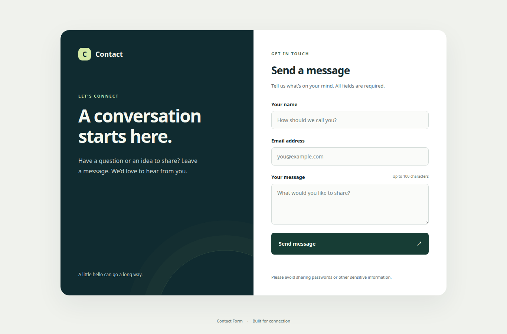
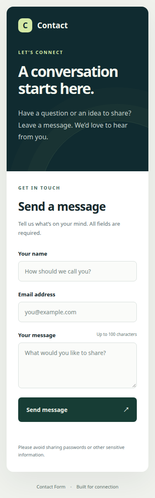
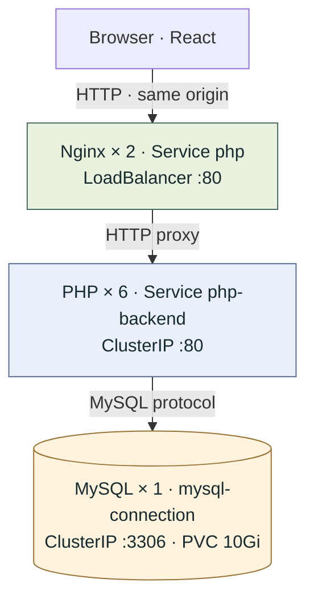

# Contact Form on Kubernetes

[](https://react.dev/)
[](https://www.typescriptlang.org/)
[](https://www.php.net/)
[](https://www.mysql.com/)
[](https://www.docker.com/)
[](https://kubernetes.io/)
[](LICENSE)
[](https://github.com/jacivaldocarvalho/kubernetes-contact-form/actions/workflows/validate.yml)

A reference project for building and deploying a database-backed contact form on
Kubernetes. It combines a React/TypeScript frontend served by Nginx, a PHP/Apache backend
and MySQL persistence with scripts for image publication and deployment.

The focus is a small, reproducible application deployment: runtime configuration,
commit-tagged images, persistent storage, input validation and availability checks.
The project is intended for learning and experimentation; production requirements
and current limitations are described below.

## Application preview

### Desktop



<details>
<summary>Mobile view</summary>



</details>

Screenshots of the running React application, captured during local kind validation.

## Architecture



See [Architecture and networking](docs/architecture.md) for DNS resolution,
Service selectors, local access, readiness dependencies and persistent storage.

Nginx serves the React bundle and proxies the PHP endpoints on the same origin.
The existing `php` LoadBalancer Service is the entry point; `php-backend` is internal.
Apache also serves the compiled frontend for direct GET compatibility. The backend
validates submissions and inserts messages using prepared statements. MySQL
credentials are supplied at runtime through a Kubernetes Secret.

The Node, Nginx, PHP and MySQL base images are pinned by digest. Deployment scripts use the
full Git commit hash as the tag for all three application images, render the manifests
with kubectl's built-in Kustomize and wait for deployment readiness.

## Requirements

- Git and a clean working tree for commit-tagged deployment.
- Docker CLI and a running Docker daemon.
- kubectl with built-in Kustomize, configured for the target cluster and namespace.
- A Kubernetes cluster with a default StorageClass able to provision a 10Gi PVC.
- Registry credentials with push access to the configured `jncarvalho` repositories.
- Linux or a Linux environment in WSL, with Bash and GNU Make. Native Windows
  execution is not supported; Docker and kubectl must be accessible inside WSL.

External access uses a LoadBalancer Service. For local clusters without an
external load balancer, use the port-forward command below.

Registry deployment requires push access to `jncarvalho/projeto-frontend` as well
as the backend and database repositories. Image repositories are currently configured in `deployment.yml` and `script.sh`.
If you use another registry or account, update both files
consistently and commit those changes before deployment.

## Getting started

Clone the repository:

```sh
git clone https://github.com/jacivaldocarvalho/kubernetes-contact-form.git
cd kubernetes-contact-form
```

For local Kubernetes development without a registry, use the
[kind and Makefile workflow](docs/local-kind.md):

```sh
make kind-up
make deploy-local
make smoke
make access
```

Run `make help` for checks, tests, logs and cluster commands. Local deployment
generates its own credentials and accepts uncommitted changes. The steps below
describe the separate registry-based deployment workflow.

Copy `.env.example` to `.env` with `cp .env.example .env`.
Replace both password placeholders with
distinct strong passwords. Values use `KEY=value` without shell quotes; the
scripts consume this file with `kubectl --from-env-file`.

| Setting | Purpose |
| --- | --- |
| `MYSQL_ROOT_PASSWORD` | Database administration password |
| `MYSQL_DATABASE` | Application database; defaults to `meubanco` |
| `MYSQL_USER` | Dedicated application user; defaults to `application` |
| `MYSQL_PASSWORD` | Application user password |

The `.env` file is excluded from Git and the Docker build context. Existing
Secrets are preserved; editing `.env` does not rotate a running database password.

Before running a deployment, confirm the cluster context and storage:

```sh
kubectl config current-context
kubectl get storageclass
```

Also confirm the intended namespace and authenticate to the configured registry
with `docker login`. The scripts **build and push images and modify the current
cluster namespace**.

Deploy with the Makefile:

```sh
make deploy-registry
```

This target calls `script.sh`, which implements registry publication and deployment.
You can also run `bash script.sh` directly. It uses the current kubectl context and
namespace; it does not create a cluster. `make deploy-local` instead uses the
dedicated kind cluster and does not publish images.

The source manifest uses an `unpublished` placeholder tag. Use the scripts to
render commit tags before applying resources; do not apply `deployment.yml`
directly. Modified or untracked repository files block deployment.

## Access and verification

Inspect the deployments and service address:

```sh
kubectl get deployments,pods,pvc
kubectl get service php
```

Open the LoadBalancer address in a browser. Alternatively, start a local tunnel:

```sh
kubectl port-forward service/php 8080:80
```

With the tunnel running, open `http://localhost:8080` or use another terminal:

```sh
curl --fail http://localhost:8080/health.php
curl --fail http://localhost:8080/index.php \
  --data-urlencode "nome=Example User" \
  --data-urlencode "email=user@example.com" \
  --data-urlencode "comentario=Hello from Kubernetes"
```

Readiness returns `Ready`. A successful submission returns
`New record created successfully` and persists a row in `mensagens`.
The POST example is a Bash command and creates a message.

## HTTP interface

| Method and path | Behavior |
| --- | --- |
| `GET /` or `GET /index.php` | Serve the React application (JavaScript required) |
| `POST /index.php` | Validate and persist a message |
| `GET /health.php` | Check database connectivity and application table access |

POST accepts form-encoded fields `nome` (50 characters), `email` (50 characters,
valid email address) and `comentario` (100 characters). All fields are required;
values are trimmed before validation.

Successful requests return HTTP 200. Invalid submissions return 422, unsupported
methods return 405 and persistence/readiness failures return 503. Error responses
exclude internal database details. Cross-origin access is not enabled.

## Frontend development

Use Node.js 24 and run:

```sh
make frontend-setup
make frontend-check
make frontend-test
make access
```

Keep the access tunnel running and use another terminal for `make frontend-dev`.
Open the Vite URL printed in that terminal. Its PHP requests are proxied to
`http://127.0.0.1:8080`; adjust `frontend/vite.config.ts` if you change that port.
See [Frontend architecture and validation](docs/frontend.md) for Docker, browser
tests and compatibility details.

## Local builds and validation

Build images without pushing or deploying:

```sh
docker build -f backend/dockerfile -t projeto-backend:local .
docker build -f database/dockerfile -t projeto-database:local .
docker build -f frontend/dockerfile -t projeto-frontend:local .
```

Image builds, PHP/Bash/JavaScript syntax checks, offline Kubernetes schema checks
and isolated integration checks have been performed. Integration covered input
validation, SQL injection text, Unicode persistence, MySQL authentication and
readiness failure/recovery. See the recorded results in the
[container runtime documentation](docs/container-runtime.md#phase-2-validation).

Automated integration and deployment tests are versioned in `tests/`. The
`Validate application` GitHub Actions workflow runs syntax, schema, image build
and test checks on pushes to `main`/`develop` and pull requests targeting `main`.
See [Testing and continuous integration](docs/testing.md) for local commands,
coverage and workflow details. The workflow does not publish images or deploy.

The local kind workflow has validated deployment, HTTP submission, PVC binding
and persistence after MySQL pod replacement. See [Local Kubernetes](docs/local-kind.md).
Chromium checks cover submission, validation, error feedback, mobile layout and
keyboard focus. WSL execution, other browsers and load testing have not been validated.

## Operations and limitations

- PHP startup/liveness checks exercise the web application independently of the
  database. Readiness queries the database; a database outage makes PHP unready.
- MySQL uses one replica with a Recreate strategy and persistent storage. Six PHP
  replicas do not make the database highly available.
- CPU/memory requests and limits are initial demonstration values, not
  load-tested sizing.
- Message IDs retain their original random range and are not guaranteed unique.
- Authentication, rate limiting, TLS termination, backups and network policies
  are not configured by this repository.
- The React frontend requires JavaScript. Assets and fonts are local; no CDN
  is needed at runtime.

This deployment targets a fresh MySQL 8.4 installation. Detailed configuration,
probe behavior, resource values, persistence and rollback guidance are available
in [Container runtime and deployment](docs/container-runtime.md).
[Phase 1 validation](docs/phase-1-validation.md) records the earlier baseline.

## License

This project is licensed under the [MIT License](LICENSE).

## Author

**Jacivaldo Carvalho**

Telecommunications Engineer | DevOps Engineer | SRE | Networking

[GitHub](https://github.com/jacivaldocarvalho) | [LinkedIn](https://www.linkedin.com/in/jacivaldocarvalho) | [Website](https://www.jacivaldocarvalho.com/)
