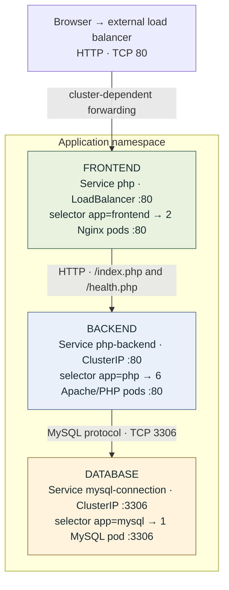
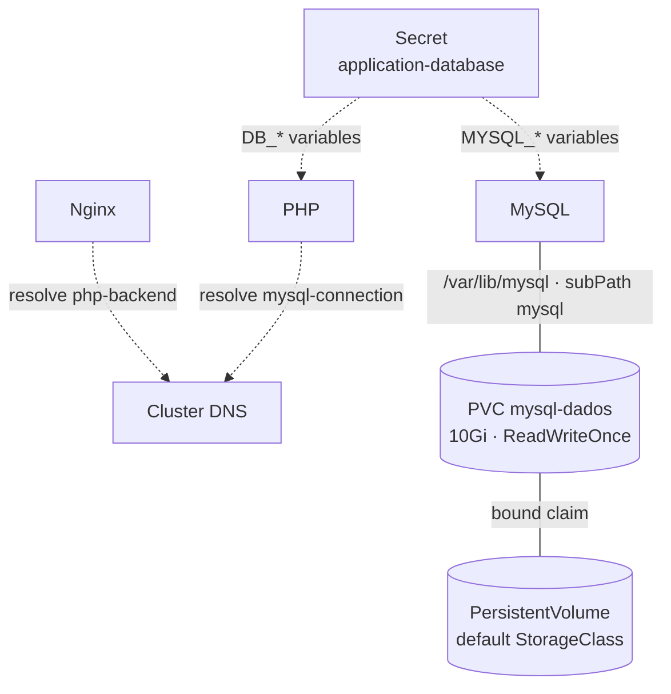
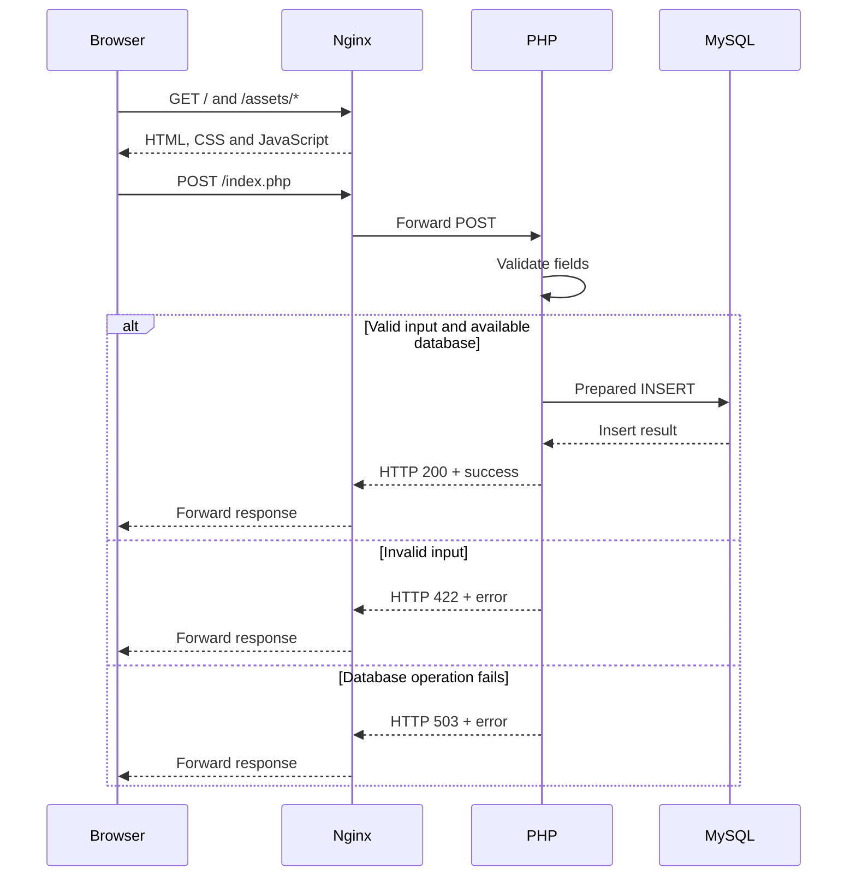
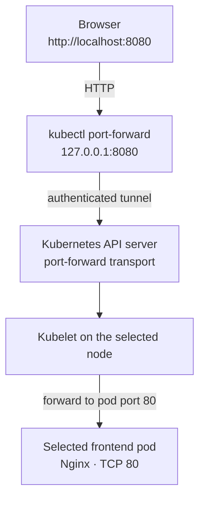

# Architecture and networking

This document describes the current resources in [deployment.yml](../deployment.yml)
and [services.yml](../services.yml), together with the
[Nginx proxy configuration](../frontend/default.conf.template). Diagrams show
logical connections, not fixed IP addresses, physical node placement or enforced
network isolation. Services provide stable discovery while pod IPs can change.

## Service and pod network



Each workload block groups its Service and selected pods. The table below lists
them as separate Kubernetes resources. Configuration and storage connections are
shown separately to keep the request path readable.

### DNS, credentials and storage



The first diagram shows the request path; dashed arrows in the second diagram represent configuration
or DNS dependencies. Storage connections represent mounts and volume binding,
not HTTP or SQL traffic. React executes in the browser; the frontend container
runs Nginx and serves the JavaScript bundle.

| Resource | Type / replicas | Selector | Service → container port | Purpose |
| --- | --- | --- | --- | --- |
| `php` | LoadBalancer Service | `app=frontend` | TCP 80 → 80 | Existing public entry point, now selecting Nginx |
| `frontend` | Deployment / 2 | `app=frontend` | Container TCP 80 | Static React files and same-origin PHP proxy |
| `php-backend` | ClusterIP Service | `app=php` | TCP 80 → 80 | Internal HTTP access to Apache/PHP |
| `php` | Deployment / 6 | `app=php` | Container TCP 80 | Form validation, persistence and database readiness |
| `mysql-connection` | ClusterIP Service | `app=mysql` | TCP 3306 → 3306 | Internal database discovery |
| `mysql` | Deployment / 1 | `app=mysql` | Container TCP 3306 | Database using the persistent volume |

The `php` Service and `php` Deployment have the same name but are different
resource kinds. The Service selects `app=frontend`, not `app=php`. The additional
`php-backend` Service selects the PHP pods. This retains the existing external
Service name and port-forward command while separating frontend and backend.

Nginx defaults to `PHP_UPSTREAM=php-backend:80`; PHP uses
`DB_HOST=mysql-connection`. These short Service names resolve within the workload
namespace. Full names follow `<service>.<namespace>.svc.<cluster-domain>`; the
cluster domain depends on the cluster configuration. DNS identifies a Service;
Service routing selects its available endpoints. ClusterIP Services are not
public endpoints, but they are not security boundaries: the repository defines
no NetworkPolicies to restrict other pods' access. Namespace boxes and tier boxes
in this diagram are organizational, not separate subnets or firewalls.

No Ingress controller, TLS termination or service mesh is configured here.
LoadBalancer provisioning and forwarding depend on the target cluster. NodePorts
and allocated Service/pod IP addresses are dynamic and intentionally omitted.

## HTTP request lifecycle



The browser never connects directly to PHP's internal Service or to MySQL.
Both assets and POST requests use the same public origin, so this deployment
requires no cross-origin API configuration. GET `/index.php` is proxied to PHP,
which serves the compiled React shell for compatibility. Unknown paths return
404. Nginx can also generate proxy errors when no backend is reachable; React
shows a generic error and retains the fields for unsuccessful requests.

## Local kind access

The kind cluster consists of a local Docker node container. The current workflow
uses kind's installed node-image default and its local storage provisioner;
node placement and replica count do not imply multiple physical hosts. The
`php` LoadBalancer Service can have a pending external address. Access uses a
localhost-only tunnel instead:



`make access` resolves `service/php` to a selected frontend pod and forwards its
port. This path bypasses the external load balancer and Service ClusterIP data
path; it is not a test of external load-balancer provisioning or distribution
across both frontend replicas. The kubeconfig and context are explicitly scoped
to `.local/<cluster>/kubeconfig` and `kind-<cluster>`. The local namespace is
`contact-form`; registry deployment instead uses the configured context/namespace.

## Probes and dependency propagation

| Workload | Startup / liveness | Readiness | Dependency |
| --- | --- | --- | --- |
| Nginx frontend | HTTP GET `/` | HTTP GET `/health.php`, proxied to PHP | PHP and MySQL |
| Apache/PHP | HTTP GET `/` | HTTP GET `/health.php`, authenticates and queries `mensagens` | MySQL |
| MySQL | Startup TCP 3306; no liveness probe | Local exec query authenticated as the application user | Listener, credentials and table |

Kubelet sends HTTP probes to pod ports directly, rather than through the public
LoadBalancer Service. MySQL readiness executes inside its container and connects
to `127.0.0.1:3306`. An unready workload is excluded from normal Service routing.
A database failure can therefore make PHP and then the frontend unready, while
their static startup/liveness endpoints remain healthy. Readiness does not
restart containers; liveness is intentionally independent of the database.

## Persistence and configuration

The namespace-scoped `mysql-dados` PVC requests 10Gi with ReadWriteOnce and binds
to a cluster-scoped PersistentVolume through the default StorageClass. MySQL
mounts it at `/var/lib/mysql` using `subPath: mysql`. Recreating its pod preserves
records when the same volume is retained. One database replica and a Recreate
strategy avoid overlapping database writers; the application has no database HA.
Deleting the local kind cluster removes its local database storage.

The `application-database` Secret supplies credentials to MySQL and PHP through
environment variables. It is a configuration dependency, not a network hop.
Nginx and React receive no database credentials. Registry deployment preserves
an existing Secret; the kind workflow generates local credentials separately.

## Inspection

Run against the dedicated local cluster:

```sh
kubectl --kubeconfig .local/contact-form/kubeconfig --context kind-contact-form \
  -n contact-form get services,pods,pvc -o wide
kubectl --kubeconfig .local/contact-form/kubeconfig --context kind-contact-form \
  -n contact-form get endpointslices
kubectl --kubeconfig .local/contact-form/kubeconfig --context kind-contact-form \
  -n contact-form get pods --show-labels
```

Use the kubeconfig/context for your chosen `KIND_CLUSTER` if it differs from the
default. These commands expose allocated addresses, actual Service endpoints and
pod labels without reading database credentials.

## References

- [Kubernetes Services](https://kubernetes.io/docs/concepts/services-networking/service/)
- [Port forwarding to applications](https://kubernetes.io/docs/tasks/access-application-cluster/port-forward-access-application-cluster/)
